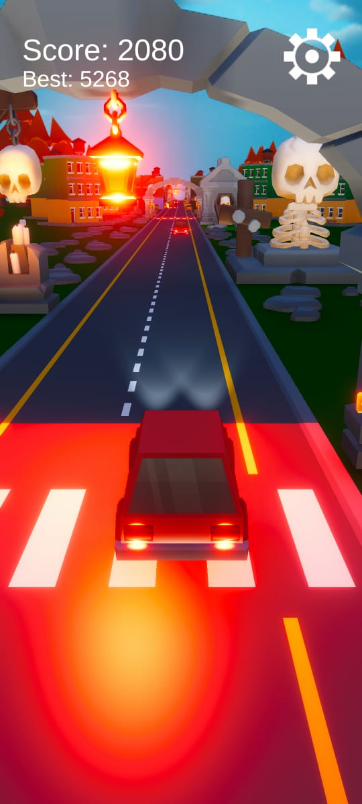

# 🚗 Endless Driving

## 🎮 Game Overview

**Endless Driving** is a fast-paced 3D runner game inspired by the legendary **Subway Surfers** — but with a twist: instead of running, you're behind the wheel! Choose your car and race through dynamic roads, dodging obstacles and testing your reflexes.

---

## 🚙 Key Features

- 🏎️ Select from multiple unique cars
- 🚧 Dodge traffic and road hazards
- 🌆 Endless roads with increasing speed
- 📱 Cross-platform support: PC, Android, and WebGL

---

## 🎯 Objective

Your goal is simple:  
**Drive as far as you can without crashing.**  
The longer you survive, the higher your score. Challenge your reflexes and break your distance record!

---

## 🕹️ Controls

### 🖥️ PC / WebGL

| Action         | Key                |
|----------------|--------------------|
| Move Left      | `A` or `←`         |
| Move Right     | `D` or `→`         |
| Brake          | `S` or `↓`         |

### 📱 Android

- **Touch Controls** for left/right
- **Auto-accelerate**
- **Brake button** on screen

---

## 🚀 Getting Started
